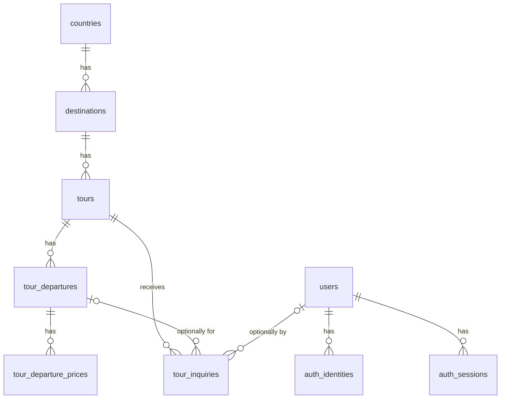

# Database Entities

PostgreSQL schema for the Ghumbo backend, defined as TypeORM entities in `src/entities/`. All entities are registered in `src/entities/index.ts`.

## Relationships



| Child → Parent | FK column | On delete |
|---|---|---|
| `destinations` → `countries` | `country_id` | `RESTRICT` |
| `tours` → `destinations` | `destination_id` | `RESTRICT` |
| `tour_departures` → `tours` | `tour_id` | `CASCADE` |
| `tour_departure_prices` → `tour_departures` | `departure_id` | `CASCADE` |
| `tour_inquiries` → `tours` | `tour_id` | `RESTRICT` |
| `tour_inquiries` → `tour_departures` | `tour_departure_id` | `SET NULL` |
| `tour_inquiries` → `users` | `user_id` | `SET NULL` |
| `auth_identities` → `users` | `user_id` | `CASCADE` |
| `auth_sessions` → `users` | `user_id` | `CASCADE` |

Effectively: a country, destination, or tour cannot be deleted while it has children / inquiries. Deleting a tour with no inquiries removes its departures and their prices. Deleting a user removes their auth identities and sessions but keeps their inquiries (detached).

## Conventions

- **Naming:** DB tables and columns are `snake_case`; TypeORM properties are `camelCase`. Every `@Column` sets `name` explicitly.
- **Primary keys:**
  - Reference data (`countries`, `destinations`, `tour_departure_prices`) uses `integer` identity columns.
  - Everything else uses a ULID stored as `varchar(26)`, generated in the app via a property initializer (`id = ulid()`).
- **Timestamps:** `created_at` / `updated_at` are `timestamptz`, managed by `@CreateDateColumn` / `@UpdateDateColumn`.
- **Calendar dates** (`date` columns) are typed as `string` (`'YYYY-MM-DD'`), never JS `Date`, to avoid timezone shifts.
- **Money** is `numeric(12,2)` and typed as `string` — pg returns numerics as strings to preserve precision. Don't do float math on it.
- **Constraint names:**

  | Kind | Pattern | Example |
  |---|---|---|
  | Foreign key | `fk_<table>_<column>` | `fk_tour_inquiries_user_id` |
  | Index | `idx_<table>_<columns>` | `idx_tours_destination_id` |
  | Check | `chk_<table>_<what>` | `chk_tour_departures_dates` |
  | Unique | `uq_<table>_<columns>` | `uq_tour_departure_prices_departure_type_currency` |
- **FK columns are indexed** (Postgres does not do this automatically).

---

## Catalog

### `countries` — `CountryEntity`

| Column | Property | Type | Null | Default | Notes |
|---|---|---|---|---|---|
| `id` | `id` | `integer` identity | | | PK |
| `status` | `status` | enum `ECountryStatus` | | `coming_soon` | |
| `name` | `name` | `varchar(255)` | | | |
| `code` | `code` | `char(2)` | | | Unique. ISO 3166-1 alpha-2, uppercase |
| `latitude` | `latitude` | `double precision` | | | |
| `longitude` | `longitude` | `double precision` | | | |
| `assets` | `assets` | `jsonb` (`TAsset[]`) | | `'[]'` | |
| `created_at` | `createdAt` | `timestamptz` | | `now()` | |
| `updated_at` | `updatedAt` | `timestamptz` | | `now()` | |

**Checks:**
- `chk_countries_code_upper`: `code = upper(code)`
- `chk_countries_latitude`: latitude between -90 and 90
- `chk_countries_longitude`: longitude between -180 and 180

### `destinations` — `DestinationEntity`

| Column | Property | Type | Null | Default | Notes |
|---|---|---|---|---|---|
| `id` | `id` | `integer` identity | | | PK |
| `country_id` | `countryId` | `integer` | | | FK → `countries.id`, indexed |
| `status` | `status` | enum `EDestinationStatus` | | `coming_soon` | |
| `name` | `name` | `varchar(255)` | | | |
| `slug` | `slug` | `varchar(255)` | | | Unique. URL slug, lowercase kebab-case |
| `overview` | `overview` | `text` | | | |
| `latitude` | `latitude` | `double precision` | | | |
| `longitude` | `longitude` | `double precision` | | | |
| `assets` | `assets` | `jsonb` (`TAsset[]`) | | `'[]'` | |
| `created_at` | `createdAt` | `timestamptz` | | `now()` | |
| `updated_at` | `updatedAt` | `timestamptz` | | `now()` | |

**Constraints:**
- `uq_destinations_slug`: unique on `slug`
- `chk_destinations_slug`: `slug ~ '^[a-z0-9]+(-[a-z0-9]+)*$'`
- `chk_destinations_latitude`: latitude between -90 and 90
- `chk_destinations_longitude`: longitude between -180 and 180

### `tours` — `TourEntity`

| Column | Property | Type | Null | Default | Notes |
|---|---|---|---|---|---|
| `id` | `id` | `varchar(26)` | | ULID | PK |
| `destination_id` | `destinationId` | `integer` | | | FK → `destinations.id`, indexed |
| `status` | `status` | enum `ETourStatus` | | `draft` | |
| `name` | `name` | `varchar(255)` | | | |
| `slug` | `slug` | `varchar(255)` | | | Unique. URL slug, lowercase kebab-case |
| `overview` | `overview` | `text` | | | |
| `duration_days` | `durationDays` | `integer` | | | |
| `duration_nights` | `durationNights` | `integer` | | | |
| `itinerary` | `itinerary` | `jsonb` (`TItinerary`) | | | |
| `inclusions` | `inclusions` | `jsonb` (`TTourInclusion[]`) | | `'[]'` | |
| `exclusions` | `exclusions` | `jsonb` (`TTourInclusion[]`) | | `'[]'` | |
| `assets` | `assets` | `jsonb` (`TAsset[]`) | | `'[]'` | |
| `is_recommended` | `isRecommended` | `boolean` | | `false` | |
| `created_at` | `createdAt` | `timestamptz` | | `now()` | |
| `updated_at` | `updatedAt` | `timestamptz` | | `now()` | |

**Constraints:**
- `uq_tours_slug`: unique on `slug` (globally, not per destination)
- `chk_tours_slug`: `slug ~ '^[a-z0-9]+(-[a-z0-9]+)*$'`
- `chk_tours_duration`: `duration_days > 0 AND duration_nights >= 0 AND duration_nights <= duration_days`

### `tour_departures` — `TourDepartureEntity`

A scheduled run of a tour with fixed dates and seat capacity.

| Column | Property | Type | Null | Default | Notes |
|---|---|---|---|---|---|
| `id` | `id` | `varchar(26)` | | ULID | PK |
| `tour_id` | `tourId` | `varchar(26)` | | | FK → `tours.id`, indexed |
| `status` | `status` | enum `ETourDepartureStatus` | | `draft` | |
| `start_date` | `startDate` | `date` (`string`) | | | |
| `end_date` | `endDate` | `date` (`string`) | | | |
| `capacity` | `capacity` | `integer` | | | |
| `booked_seats` | `bookedSeats` | `integer` | | `0` | |
| `created_at` | `createdAt` | `timestamptz` | | `now()` | |
| `updated_at` | `updatedAt` | `timestamptz` | | `now()` | |

**Checks:**
- `chk_tour_departures_capacity`: `capacity > 0`
- `chk_tour_departures_booked_seats`: `booked_seats >= 0 AND booked_seats <= capacity`
- `chk_tour_departures_dates`: `end_date >= start_date`

> **Booking seats:** the check constraint is a safety net against overbooking, not the booking mechanism. Increment atomically:
> ```sql
> UPDATE tour_departures
> SET booked_seats = booked_seats + $n
> WHERE id = $id AND booked_seats + $n <= capacity
> ```
> and treat 0 affected rows as "sold out".

### `tour_departure_prices` — `TourDeparturePriceEntity`

Per-departure price, one row per (price type, currency).

| Column | Property | Type | Null | Default | Notes |
|---|---|---|---|---|---|
| `id` | `id` | `integer` identity | | | PK |
| `departure_id` | `departureId` | `varchar(26)` | | | FK → `tour_departures.id` |
| `type` | `type` | enum `ETourDeparturePriceType` | | | |
| `currency` | `currency` | enum `ECURRENCY` | | | |
| `amount` | `amount` | `numeric(12,2)` (`string`) | | | |
| `created_at` | `createdAt` | `timestamptz` | | `now()` | |
| `updated_at` | `updatedAt` | `timestamptz` | | `now()` | |

**Constraints:**
- `uq_tour_departure_prices_departure_type_currency`: unique on `(departure_id, type, currency)`. Its index also serves lookups by `departure_id`.
- `chk_tour_departure_prices_amount`: `amount >= 0`

### `tour_inquiries` — `TourInquiryEntity`

A lead submitted for a tour, optionally for a specific departure and optionally by a logged-in user.

| Column | Property | Type | Null | Default | Notes |
|---|---|---|---|---|---|
| `id` | `id` | `varchar(26)` | | ULID | PK |
| `tour_id` | `tourId` | `varchar(26)` | | | FK → `tours.id`, indexed |
| `tour_departure_id` | `tourDepartureId` | `varchar(26)` | ✓ | | FK → `tour_departures.id`, indexed. Null = general tour inquiry |
| `user_id` | `userId` | `varchar(26)` | ✓ | | FK → `users.id`, indexed. Null = guest |
| `travel_date` | `travelDate` | `date` (`string`) | ✓ | | Preferred date when no departure is chosen |
| `name` | `name` | `varchar(100)` | | | |
| `email` | `email` | `varchar(254)` | | | |
| `phone` | `phone` | `varchar(16)` | ✓ | | E.164 |
| `traveler_count` | `travelerCount` | `integer` | | | |
| `query` | `query` | `text` | ✓ | | Free-text message from the customer |
| `status` | `status` | enum `ETourInquiryStatus` | | `new` | |
| `status_notes` | `statusNotes` | `text` | ✓ | | Internal notes |
| `created_at` | `createdAt` | `timestamptz` | | `now()` | |
| `updated_at` | `updatedAt` | `timestamptz` | | `now()` | |

**Constraints:**
- `idx_tour_inquiries_status_created_at`: index on `(status, created_at)` for the admin lead list (filter by status, sort by newest)
- `chk_tour_inquiries_traveler_count`: `traveler_count > 0`

> The DB does not verify that `tour_departure_id` belongs to `tour_id`. Validate this in the service layer when creating an inquiry.

---

## Users

### `users` — `UserEntity`

| Column | Property | Type | Null | Default | Notes |
|---|---|---|---|---|---|
| `id` | `id` | `varchar(26)` | | ULID | PK |
| `name` | `name` | `varchar(50)` | | | |
| `email` | `email` | `citext` | ✓ | | Unique, case-insensitive. Null for phone-only users |
| `phone` | `phone` | `varchar(16)` | ✓ | | Unique. E.164 |
| `role` | `role` | enum `EUserRole` | | `customer` | |
| `photo` | `photo` | `jsonb` (`TAsset`) | ✓ | | |
| `created_at` | `createdAt` | `timestamptz` | | `now()` | |
| `updated_at` | `updatedAt` | `timestamptz` | | `now()` | |

> `citext` requires the `citext` extension. TypeORM runs `CREATE EXTENSION IF NOT EXISTS citext` on startup, which needs a DB role with permission to create extensions.

### `auth_identities` — `AuthIdentityEntity`

One row per login method linked to a user (email + password, phone OTP, Google, …).

| Column | Property | Type | Null | Default | Notes |
|---|---|---|---|---|---|
| `id` | `id` | `varchar(26)` | | ULID | PK |
| `user_id` | `userId` | `varchar(26)` | | | FK → `users.id` |
| `provider` | `provider` | enum `EAuthIdentityProvider` | | | |
| `provider_user_id` | `providerUserId` | `varchar(255)` | | | The user's ID at the provider: email address for `email`, E.164 number for `phone`, Google `sub` for `google` |
| `password_hash` | `passwordHash` | `varchar(255)` | ✓ | | Only for `email` identities with a password |
| `is_verified` | `isVerified` | `boolean` | | `false` | |
| `created_at` | `createdAt` | `timestamptz` | | `now()` | |
| `updated_at` | `updatedAt` | `timestamptz` | | `now()` | |

**Constraints:**
- `uq_auth_identities_user_id_provider`: unique on `(user_id, provider)`, so a user has at most one identity per provider. Its index also serves lookups by `user_id`.
- `uq_auth_identities_provider_provider_user_id`: unique on `(provider, provider_user_id)`, so one email / phone / Google account can't be linked to two users.

> Normalize `provider_user_id` before writing (lowercase emails, E.164 phones). Unlike `users.email`, it's not `citext`.

### `auth_sessions` — `AuthSessionEntity`

One row per refresh token / logged-in device.

| Column | Property | Type | Null | Default | Notes |
|---|---|---|---|---|---|
| `id` | `id` | `varchar(26)` | | ULID | PK |
| `user_id` | `userId` | `varchar(26)` | | | FK → `users.id`, indexed |
| `refresh_token_hash` | `refreshTokenHash` | `char(64)` | | | Unique. SHA-256 hex of the refresh token |
| `user_agent` | `userAgent` | `text` | | | |
| `ip_address` | `ipAddress` | `inet` | | | IPv4 or IPv6 |
| `device_id` | `deviceId` | `varchar(255)` | | | |
| `expires_at` | `expiresAt` | `timestamptz` | | | |
| `revoked_at` | `revokedAt` | `timestamptz` | ✓ | | Set on logout / revocation |
| `last_used_at` | `lastUsedAt` | `timestamptz` | | `now()` | |
| `created_at` | `createdAt` | `timestamptz` | | `now()` | |

---

## Enums

Stored as native Postgres enum types. Values can be added later, but not removed or renamed without a migration.

| Enum | Source | Values |
|---|---|---|
| `ECountryStatus` | `types/countries.type.ts` | `coming_soon`, `live` |
| `EDestinationStatus` | `types/destinations.type.ts` | `coming_soon`, `live` |
| `ETourStatus` | `types/tours.type.ts` | `draft`, `live` |
| `ETourDepartureStatus` | `types/tour_departures.type.ts` | `draft`, `open`, `cancelled`, `completed` |
| `ETourDeparturePriceType` | `types/tour_departure_prices.type.ts` | `adult`, `couple`, `child` |
| `ECURRENCY` | `types/misc.type.ts` | `inr`, `usd`, `cad`, `aed` |
| `ETourInquiryStatus` | `types/tour_inquiries.type.ts` | `new`, `contacted`, `in_progress`, `converted`, `closed` |
| `EUserRole` | `types/users.type.ts` | `customer`, `admin`, `guide` |
| `EAuthIdentityProvider` | `types/auth_identities.type.ts` | `email`, `phone`, `google` |

## JSONB shapes

Shapes are defined as Zod schemas, so validate with them before writing. The database does not enforce them.

**`TAsset`** (`types/misc.type.ts`)
```ts
{
  label: string;               // min 3 chars
  description: string | null;
  type: 'image' | 'video';
  url: string;                 // URL
  thumbnail_url: string | null;
  sort_order: number;          // int >= 0, default 0
}
```

**`TItinerary`** (`types/tours.type.ts`)
```ts
{
  days: {
    day: number;               // int > 0
    title: string;
    overview: string | null;
    location: string | null;
    activities: {
      title: string;
      description: string | null;
      start_time: string | null;
      end_time: string | null;
      location: string | null;
      type: 'sightseeing' | 'activity' | 'meal' | 'transfer' | 'accommodation' | 'free_time' | 'other';
      included: boolean;       // default true
    }[];
    meals: ('breakfast' | 'lunch' | 'dinner')[];
    accommodation: string | null;
  }[];
}
```

**`TTourInclusion`** (`types/tours.type.ts`)
```ts
{ title: string; description: string; }
```

## Schema sync

There are no migrations yet. The schema is applied with `synchronize: true` only when `ENV=local` (see `src/configs/db.config.ts`).
- Adding a check constraint fails if existing rows violate it.
- Column renames or type changes can make TypeORM drop and recreate the column, which loses that column's data.
- Before deploying anywhere non-local, generate migrations from these entities.
